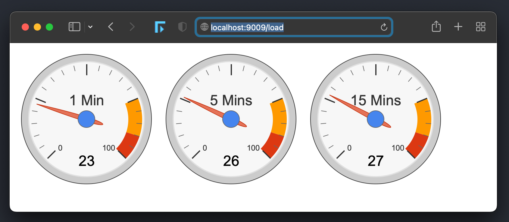

### Show System Load Average Using Google Charts

> This is a self-updating (google) chart, which checks for load average every second

> Golang backend checks for load average and sends metrics to the front-end (UI) using websockets.

#### Initialize & Get The Dependencies

After cloning the repository >

```bash
go mod init;go mod tidy;
```

```bash
go get -u -v ./...
```

#### Build The Binary

```bash
go build -o websocket_loadavg
```

Web/UI : Make sure you have `index.html`

In this example `index.html` is inside `static/index.html`

> To run the program

```bash
./websocket_loadavg -static static
```

> Output

```bash
Socket Server Starting...
2022/04/28 13:14:19 NumCPUCores : 12
2022/04/28 13:14:19 http server : listening on port 9009 ...
2022/04/28 13:14:19 http server : listening on port 9000 ...
```

> Access The UI

http://localhost:9009/load

#### Sample Calculations (Example)

If the number of CPU cores on the machine is 12, and load average in the last
```
- 1 min is   : 8
- 5 mins is  : 6
- 15 mins is : 3
```

Then the load average percentage (%) calculation in the last
```
- 1 min is   : 8/12 * 100 => 66%
- 5 mins is  : 6/12 * 100 => 50%
- 15 mins is : 3/12 * 100 => 25%
```

#### Load Average



#### Once the browser opens the URL () , you will see the following output

```bash
./websocket_loadavg -static static

Socket Server Starting...
2022/04/28 13:14:19 NumCPUCores : 12
2022/04/28 13:14:19 http server : listening on port 9009 ...
2022/04/28 13:14:19 http server : listening on port 9000 ...
2022/04/28 13:14:19 loadAverage : map[max_cores:12 min1:3.13916015625 min15:3.267578125 min15_percent:27.229817708333332 min1_percent:26.15966796875 min5:3.34912109375 min5_percent:27.909342447916668]
2022/04/28 13:15:12 Client Connected
Hi From the Client!
2022/04/28 13:15:13 loadAverage : map[max_cores:12 min1:2.4560546875 min15:3.1806640625 min15_percent:26.505533854166668 min1_percent:20.467122395833336 min5:3.10888671875 min5_percent:25.907389322916668]
2022/04/28 13:15:14 loadAverage : map[max_cores:12 min1:2.4560546875 min15:3.1806640625 min15_percent:26.505533854166668 min1_percent:20.467122395833336 min5:3.10888671875 min5_percent:25.907389322916668]
2022/04/28 13:15:15 loadAverage : map[max_cores:12 min1:2.4560546875 min15:3.1806640625 min15_percent:26.505533854166668 min1_percent:20.467122395833336 min5:3.10888671875 min5_percent:25.907389322916668]
...
...
...
<continues>
```

#### To supress the output, run it this way

```bash
./websocket_loadavg -static static  > /dev/null 2>&1
```